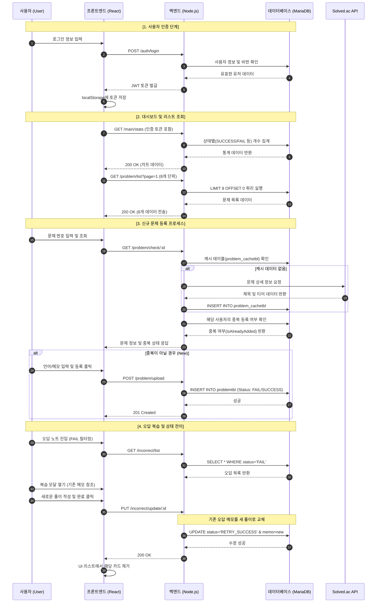

# Study Log : 알고리즘 문제 풀이 관리 웹 앱

## 프로젝트 목적과 범위
 - 프로젝트 목적 
   본 프로젝트는~~ 
 - 범위 
   범위~~!
 
## 분석
 - [유스케이스와 유스케이스 명세서](docs/usecase.md "유스케이스")
 - [요구분석명세서](docs/srs.md "요구분석명세서")

## 설계

### 시퀀스 다이어그램

### 순서도

## 구현
### 구현 환경
- 프론트앤드 : `react`
- 백앤드 : `node.js`
- 데이터 베이스 : `Mariadb`

### 사용 라이브러리
#### 1.Backend
- `express` : 웹 서버 프레임 워크
- `bcrypt` : 사용자 비밀번호 암호화
- `jsonwebtoken (JWT)` : 토큰 기반 사용자 인증 구현 
- `mariadb` : MariaDB 연결 및 쿼리 실행
- `dotenv` : 환경 변수 관리
- `cors` : 리소스 공유 설정

#### 2.Frontend
- `axios` : 백엔드와 API 비동기 통신
- `react-router-dom` : 라우팅 및 페이지 관리
- `recharts` : 데이터 시각화

## 실험
- [테스트 시나리오](docs/test_scenario.md "테스트시나리오")

## 결론
