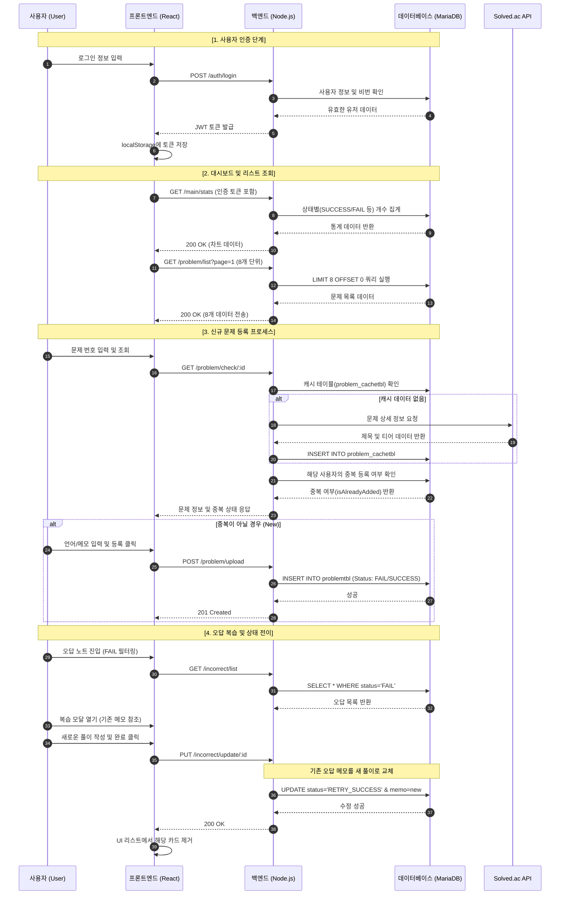
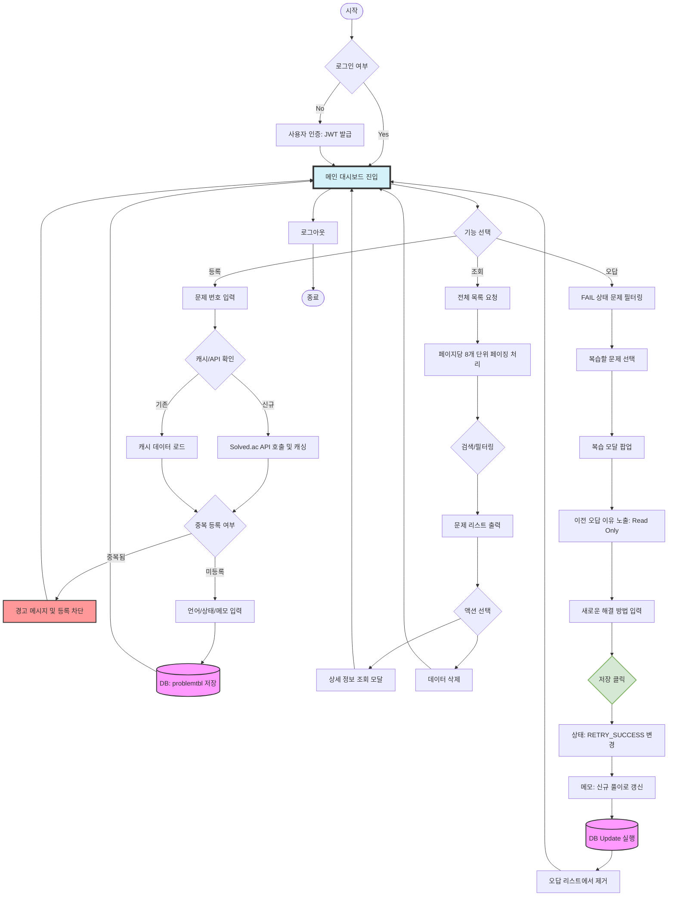
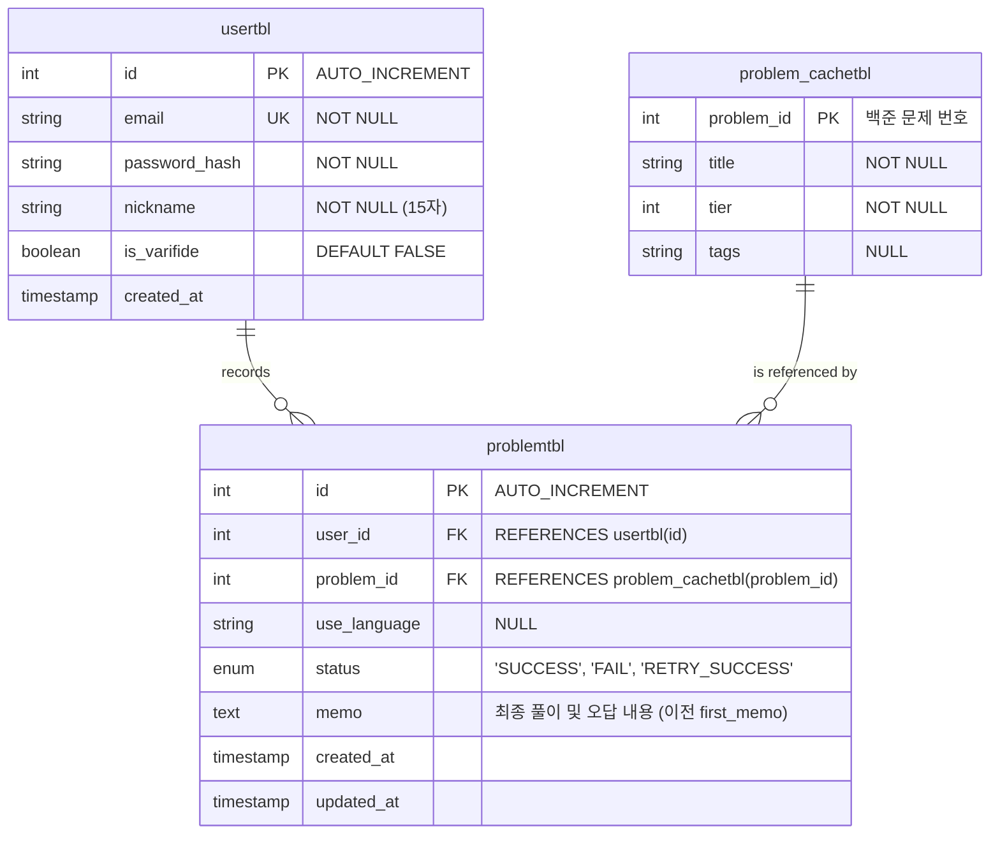

# Study Log : 알고리즘 문제 풀이 관리 웹 앱

## 프로젝트 목적과 범위
 - 프로젝트 목적 
   본 프로젝트는 사용자가 오답의 원인을 직접 기록하고, 'FAIL' 상태에서 'RETRY_SUCCESS' 상태로 전이되는 과정을 시각화함으로써 메타인지 기반의 자기주도적 학습을 지원하는 관리 시스템의 구축을 목표로 삼고있음. 
   
 - 포함 내용  
   1. 인증 및 보안: JWT 기반의 회원 인증 및 Bcrypt 암호화를 통한 사용자 데이터 보호.

   2. 데이터 연동 및 최적화: Solved.ac API를 통한 문제 정보(제목, 티어) 자동 수집 및 캐싱 테이블을 활용한 서버 부하 최소화.

   3. 학습 상태 관리: SUCCESS, FAIL, RETRY_SUCCESS 3단계 상태 전이 로직 구현.

   4. UX 특화 기능: 가독성을 고려한 8개 단위의 데이터 페이징, 오답 복기 시 이전 기록 참조 UI, 중복 등록 원천 차단 로직.

   5. 통계 대시보드: 전체 풀이 현황 및 난이도별 분포 시각화.

 - 불포함 내용  
   1. 백준 등의 플렛폼 내에서 문제 풀이 후 결과 제출 시 자동으로 결과를 자동적으로 가져오는 것이 아닌, 사용자가 결과를 직접 입력하도록 제한함.

   2. 모바일 앱 개발은 제외하며, PC 환경에 최적화된 웹 서비스로 구현함.
      
## 분석
 - [유스케이스와 유스케이스 명세서](docs/usecase.md "유스케이스")
 - [요구분석명세서](docs/srs.md "요구분석명세서")

## 설계

### 시퀀스 다이어그램

### 순서도

## 구현
### 구현 환경
- 프론트앤드 : `react`
- 백앤드 : `node.js`
- 데이터 베이스 : `Mariadb`

### 사용 라이브러리
#### 1.Backend
- `express` : 웹 서버 프레임 워크
- `bcrypt` : 사용자 비밀번호 암호화
- `jsonwebtoken (JWT)` : 토큰 기반 사용자 인증 구현 
- `mariadb` : MariaDB 연결 및 쿼리 실행
- `dotenv` : 환경 변수 관리
- `cors` : 리소스 공유 설정

#### 2.Frontend
- `axios` : 백엔드와 API 비동기 통신
- `react-router-dom` : 라우팅 및 페이지 관리
- `recharts` : 데이터 시각화

### 데이터 베이스 erd

### api 명세서
- **인증 방식**: JWT (JSON Web Token)
- **인증 헤더**: 모든 인가(Authenticated) 요청은 헤더에 `Authorization: Bearer {TOKEN}`을 포함해야 함.
- **응답 형식**: JSON

#### 1. 사용자 인증 (Authentication)

| 기능 | Method | URL | 인증 | 설명 |
| :--- | :---: | :--- | :---: | :--- |
| **로그인** | `POST` | `/login` | N | 이메일/비밀번호 검증 및 토큰 발급 (14일 유지) |
| **로그아웃** | `GET` | `/logout` | N | 로그아웃 성공 메시지 반환 |
| **회원가입** | `POST` | `/register` | N | 신규 사용자 등록 (비밀번호 정책 및 닉네임 15자 제한) |
| **이메일 중복 확인** | `POST` | `/register/emailCheck` | N | 가입 전 이메일 중복 여부 확인 |

### [POST] /register (Password Policy)
- **조건**: 8자 이상, 대/소문자, 숫자, 특수문자 각 1자 이상 포함 필수.

---

#### 2. 메인 대시보드 (Main Dashboard)

| 기능 | Method | URL | 인증 | 설명 |
| :--- | :---: | :--- | :---: | :--- |
| **통계 데이터 조회** | `GET` | `/main` | Y | 4단 위젯 통계, 난이도 분포, 언어 통계, 최근 복습 목록 조회 |

- **주요 응답 데이터**:
    - `summary`: 전체, 성공, 실패, 복습완료(RETRY_SUCCESS) 개수.
    - `difficultyData`: 상(Tier 11+), 중(Tier 6-10), 하(Tier 1-5) 분포.
    - `languageData`: 사용 언어별 문제 풀이 수.
    - `reviewList`: 최근 실패(FAIL)한 문제 중 가장 최근 3건.

---

#### 3. 문제 관리 (Problem CRUD)

| 기능 | Method | URL | 인증 | 설명 |
| :--- | :---: | :--- | :---: | :--- |
| **전체 목록 조회** | `GET` | `/problem` | Y | 본인 등록 전체 데이터 (페이지당 8개 페이징 처리) |
| **문제 정보 확인** | `GET` | `/problem/check/:problemId` | Y | 캐시 확인 혹은 Solved.ac API 기반 문제 정보 조회 |
| **신규 문제 등록** | `POST` | `/problem/upload` | Y | 문제 번호, 상태, 언어, 메모 내용 저장 |
| **문제 정보 수정** | `PUT` | `/problem/update/:id` | Y | 기존 기록의 상태, 언어, 메모 업데이트 |
| **문제 데이터 삭제** | `DELETE` | `/problem/delete/:id` | Y | 특정 풀이 데이터 삭제 |

---

#### 4. 오답 노트 관리 (Incorrect Note)

| 기능 | Method | URL | 인증 | 설명 |
| :--- | :---: | :--- | :---: | :--- |
| **오답 목록 조회** | `GET` | `/incorrect` | Y | 상태가 `FAIL`인 데이터만 필터링 조회 (8개 단위) |
| **복습 완료 업데이트** | `PUT` | `/incorrect/update/:id` | Y | 풀이 기록 갱신 및 상태 `RETRY_SUCCESS`로 변경 |
| **오답 기록 삭제** | `DELETE` | `/incorrect/delete/:id` | Y | 오답 리스트 내 특정 데이터 삭제 |

- **복습 완료 로직**: 오답 노트 저장 시 상태값이 `RETRY_SUCCESS`로 강제 교정되어 데이터 무결성을 유지함.

---

#### 5. 에러 코드 및 상태 (HTTP Status Codes)

| 코드 | 의미 | 설명 |
| :--- | :--- | :--- |
| **200** | OK | 요청 성공 |
| **201** | Created | 리소스 생성 성공 (회원가입, 문제 등록 등) |
| **400** | Bad Request | 필수 값 누락 혹은 유효성 검사 실패 |
| **401** | Unauthorized | 토큰 미포함, 만료 혹은 잘못된 비밀번호 |
| **404** | Not Found | 수정/삭제 대상을 찾을 수 없음 |
| **409** | Conflict | 이미 사용 중인 이메일 주소 |
| **500** | Internal Error | 서버 내부 로직 오류 |

## 실험
- [테스트 시나리오](docs/test_scenario.md "테스트시나리오")

## 결론

## UI 구현 
### 1. 로그인 페이지
 

### 2. 회원가입 페이지

### 3. 메인 대시보드

### 4. 문제 게시판

### 5. 문제 등록 모달

### 6. 오답노트

### 7. 오답노트 등록 모달

### - 프로젝트 요약 및 성과
- 목표 달성: 백준의 Solved.ac API를 연동한 메타인지 학습 보조 도구 'Study Log'를 성공적으로 구축함.

- 핵심 기능 구현: JWT 기반의 보안 인증, 페이징을 통한 UX 최적화, FAIL 상태에서 RETRY_SUCCESS로 이어지는 상태 전이 모델을 실제 웹 환경에서 구현함.
  
### - 추후 개선 사항
#### 1. 이메일 인증 과정 추가   
- 현재 이메일 유효성 검증 로직을 구현하지 않아, 존재하지 않는 이메일이더라고 가입이 가능. 회원 가입 시 이메일 유효성 검증 추가 필요함.
#### 2. 페이징 개선 
- 한 페이지의 8개의 게시글을 보여주도록 구현하려고 했지만 6게 혹은 7개의 게시물이 등록되었을때 새로운 페이지가 생성됨. 수정 필요함.
#### 3. 게이미피케이션 추가   
- 문제를 등록할때마다 문제 난이도에 따른 경험치를 부과하며, 사용자에게 본 서비스를 이용할 동기부여가 목적임. 
