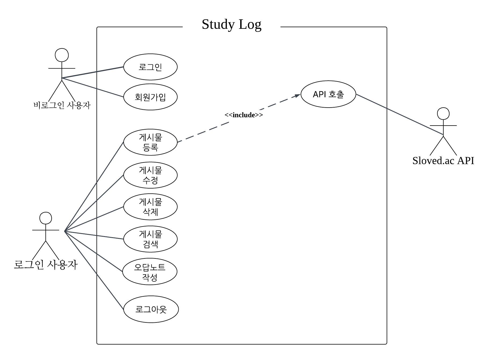

## 유스케이스

---

## 엑터 정의
|엑터|설명|
|-----|-----|
|비로그인 사용자| 회원가입, 로그인만 가능|
|로그인 사용자|모든 기능 사용 가능|
|sloved.ac API| 백준 문제 정보 자동 조회(외부 시스템}|

---

## 유스케이스 명세

|시스템 제목|Study_Log|
|--------|-------------------------|
|유스케이스 이름|회원가입|
|액터|비로그인 사용자|
|시작조건| 사용자가 로그인 상태가 아니고, 이 서비스에 가입하지 않은 상태가 아니다.|
|기본흐름| 1. 사용자가 회원가입 페이지에 접속한다.   2. 이메일, 비밀번호, 닉네임을 입력한다.   3. 시스템이 이메일 형식을 검증한다.   4. 시스템이 이메일 중복 여부를 확인한다.    5. 시스템이 비밀번호를 암호화한다.   6. DB에 사용자 정보를 저장한다.   7. 로그인 페이지로 이동한다.|
|대안흐름|3a. 잘못된 형식의 이메일이 입력되면 "잘못된 이메일 형식입니다."를 표시한다.   3b. 비밀번호가 보안기준을 넘기지 못하면 "비밀번호의 보안 수준이 낮습니다." 표시한다.   4a. 중복 확인시 이미 사용중인 이메일이면 "이미 사용 중인 이메일입니다."를 표시한다.
|종료조건|가입에 성공하면 DB에 사용자의 정보가 등록된다. 사용자는 로그인 페이지로 이동한다.|

|시스템 제목|Study_Log|
|--------|-------------------------|
|유스케이스 이름|로그인|
|액터|비로그인 사용자|
|시작조건|사용자가 로그인을 하지 않은 상태이고, 가입한 계정이 존재한다.|
|기본흐름| 1. 사용자가 로그인 페이지에 접속한다.   2. 이메일, 비밀번호를 입력한다.   3. 시스템이 이메일로 사용자를 조회한다.   4. 시스템이 bcrypt로 비밀번호를 검증한다.   5. JWT 토큰을 발급해 localStorage에 저장한다.   6. 메인페이지로 이동한다.|
|대안흐름|2a. DB에 등록되어 있지 않은 이메일로 로그인을 시도할 시 "가입되어있지 않은 이메일이거나 비밀번호가 틀렸습니다."를 표시한다.   4a. 잘못된 비밀번호가 입력되었을 시 2a와 동일한 메시지 표시한다.|
|종료조건|JWT 토큰이 localStorage에 저장되면 메인페이지로 이동한다.|

|시스템 제목|Study_Log|
|-----|-----|
|유스케이스 이름|로그아웃|
|액터|로그인 사용자|
|시작조건|사용자가 로그인 상태이고, 로그아웃 버튼을 클릭한다.|
|기본흐름|1. 사용자가 네비게이션 바의 로그아웃 버튼을 클릭한다.   2. 시스템이 localStorage에서 JWT 토큰을 삭제한다.   3. 로그인 페이지로 이동한다.|
|대안흐름|없음|
|종료조건|localStorage에서 JWT 토큰이 삭제된다.   사용자는 로그인 페이지로 이동한다.|

|시스템 제목|Study_Log|
|-----|-----|
|유스케이스 이름|게시물 등록|
|액터|로그인 사용자, Sloved.ac API|
|시작조건|사용자가 로그인 상태이다.|
|기본흐름|1. 사용자가 문제 등록 페이지에   2. 백준에서 풀이한 문제를 입력한다.   3. 시스템이 url에서 문제번호를 파싱하고, 사이트를 감지한다.   4. 시스템이 DB 캐시를 확인한다.   5. 캐시가 없으면 Sloved.ac API를 호출해 제목/난이도를 가져온다.   6. 제목, 난이도가 자동으로 입력된다.   7. 사용자다 정답/오답을 선택한다.   8. 정답 선택 시 문제 풀이 과정을 입력한다.   9. 오답 선택 시 오답 이유를 입력한다.   10. 태그, 사용언어를 선택한다.   11. 등록 버튼 클릭 시 DB에 저장한다.   12. 문제 목록으로 이동한다.|
|대안흐름|2a. 백준의 url이 아닐 시, "올바른 백준 url을 입력해주세요." 표시한다.   2b. 이미 등록된 url일 시 "이미 등록된 문제입니다." 표시한다.   5a. Sloved.ac API 호츨 실페 시 제목과 난이도를 직접 입력으로 전환한다.|
|종료조건|등록한 문제가 정답일 경우 맞춘 문제 목록에 저장한다. 등록한 문제가 오답일 경우 오답노트에 문제가 표시된다.|

|시스템 제목|Study_Log|
|------|-----|
|유스케이스 이름|게시물 수정|
|액터|로그인 사용자|
|시작조건|사용자가 로그인 상태이고 해당 문제가 본인이 등록한 상태이다.|
|기본흐름|1. 수정을 원하는 문제의 상세 페이지에서 수정 버튼을 클릭한다.   2. 수정 페이지에 접속한다.   3. 메모, 테그, 언어 등을 수정한다.   4. 저장 버튼을 클릭하면 수정한 내용을 DB에 반영한다.   5. 문제 상세 페이지로 돌아간다.|
|대안흐름|4a. 취소 버튼을 클릭할 시 수정 폼을 닫고 상세 페이지로 돌아간다.|
|종료조건|수정 내용이 DB에 반영되고 상세 페이지로 이동한다.|

|시스템 제목|Study_Log|
|--------|-------------------------|
|유스케이스 이름|게시물 삭제|
|액터|로그인 사용자|
|시작조건|사용자가 로그인 상태이고 해당 문제가 본인이 등록한 문제이다.|
|기본흐름|1. 문제 상세 페이지에서 삭제 버튼을 클릭한다.   2. "문제를 삭제하시게습니까?" 확인 메시지를 표시한다.   3. 확인 클릭 시 DB에서 해당 문제를 삭제한다.   4. 게시물 목록에서 삭제한 문제의 표기가 없어진다.   5. 게시물 목록으로 이동한다.|
|대안흐름|2a. 취소 클릭 시 확인 메시지를 닫고 게시물 목록 페이지로 이동한다.|
|종료조건|문제가 DB에서 삭제되고 게시물 목록 페이지로 이동한다.|

|시스템 제목|Study_Log|
|--------|-------------------------|
|유스케이스 이름|오답노트 작성|
|액터|로그인 사용자|
|시작조건|사용자가 로그인 상태이고, 틀린 문제를 다시 푼 상황이다.|
|기본흐름|1. 오답노트에서 문제 해결 버튼을 클릭한다.   2. 풀이 과정을 입력한다.   3. 확인을 클릭 시 status를 복습완료로 변경한다.   4. 오답노트에서 해당 문제가 제거된다.   5. 게시물 페이지에 문제를 등록한다.|
|대안흐름|3a. 풀이 과정을 입력하지 않을 시 "풀이 과정을 입력해주세요"를 표시한다.   취소 클릭 시 풀이 과정 등록 페이지를 닫고 오답노트 페이지로 돌아간다.|
|종료조건|문제 상태가 복습 완료로 바뀌고 오답노트에서 제거된다.|
